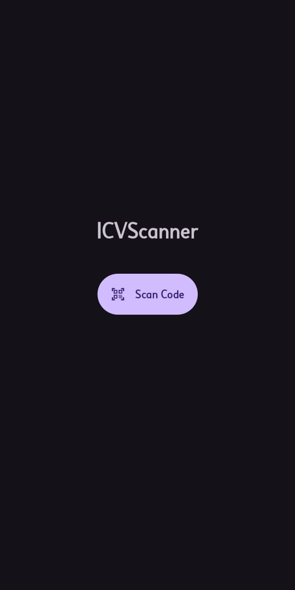
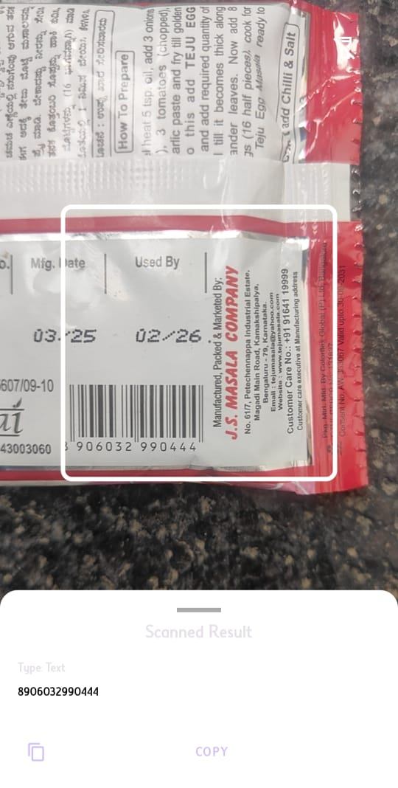
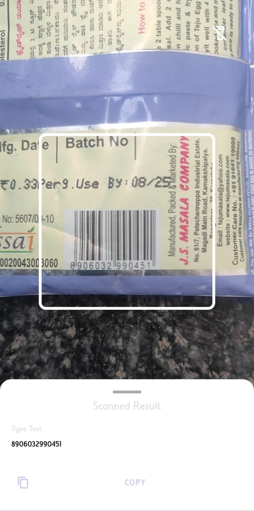
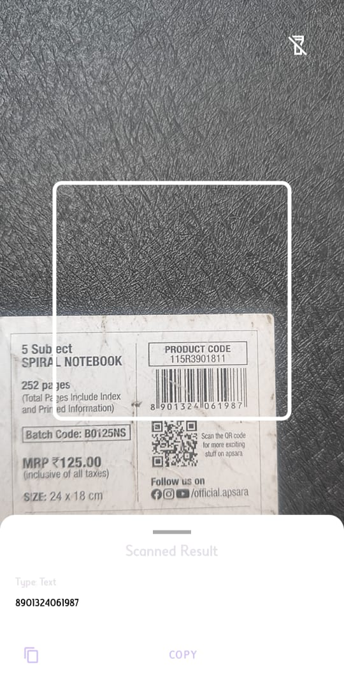
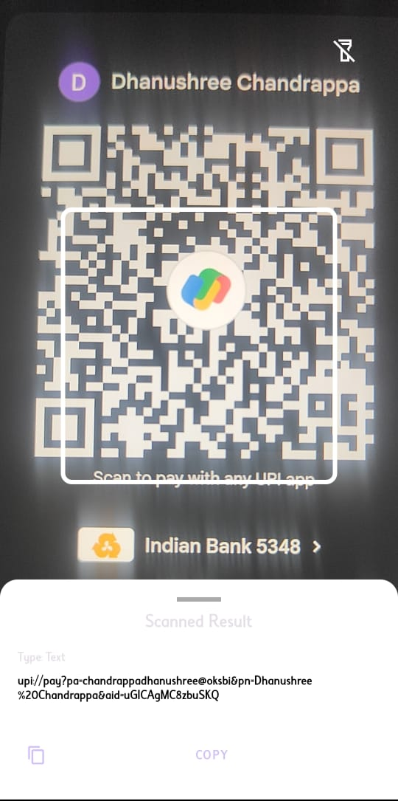
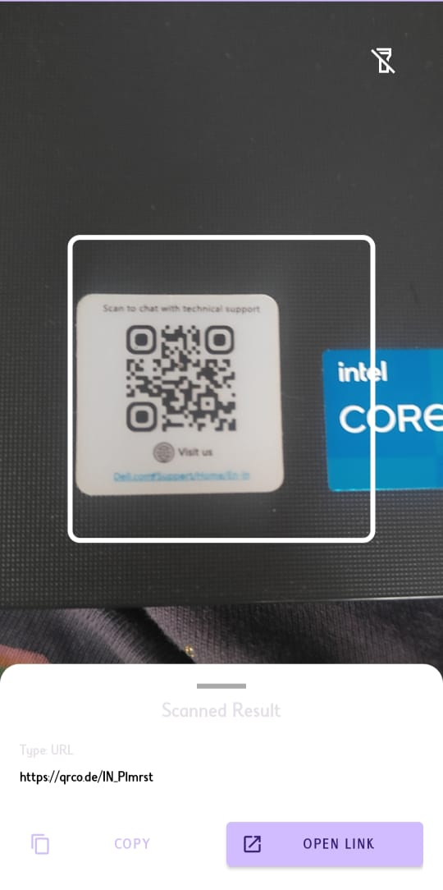
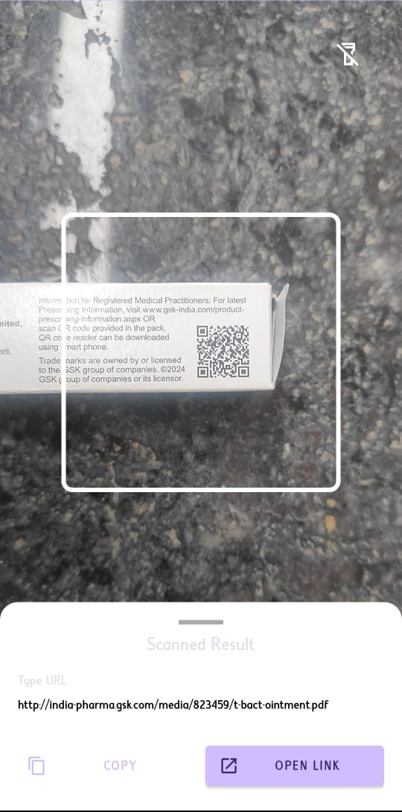

# Smart Barcode & QR Code Scanner for Android

A high-performance, user-friendly barcode and QR code scanner for Android, built natively with Kotlin. This app uses on-device machine learning to provide instant, offline scanning capabilities with intelligent, context-aware actions.

## Key Features
- **Real-Time Scanning:** Uses CameraX and Google's ML Kit (TensorFlow Lite) for instant, on-device detection.
- **Smart Actions:** Intelligently parses scanned content (URLs, Wi-Fi, Contacts) and provides one-tap action buttons.
- **Modern UI:** Features a polished user interface with a BottomSheet, viewfinder, and flashlight toggle.
- **Enhanced UX:** Includes haptic feedback and visual animations for a satisfying user experience.

## Technology Stack
- **Language:** Kotlin
- **Toolkit:** Android Studio, Gradle
- **Core Libraries:**
  - CameraX
  - Google ML Kit (Barcode Scanning)
  - TensorFlow Lite (via ML Kit)
  - Material Design Components

## Screenshots

